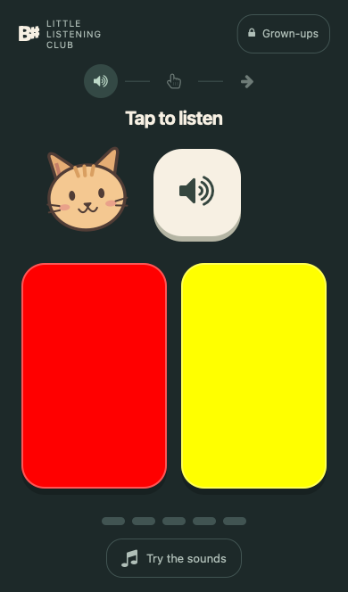
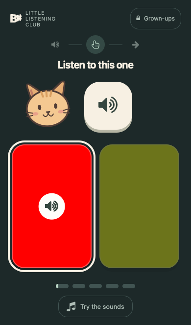

# BSharp: Perfect Pitch Trainer

BSharp is a chord-to-color listening game inspired by Eguchi’s chord identification method. It is designed for short, adult-supported practice with young children. It is a practice aid, not a guarantee or assessment of absolute pitch.

<p align="center">
  <a href="https://play.google.com/store/apps/details?id=com.bsharp.app">
    
  </a>
</p>

<p align="center">
  <a href="https://play.google.com/store/apps/details?id=com.bsharp.app">
    <strong>See it on the Play Store</strong>
  </a>
</p>

## Child-friendly play

 

The child view works through pictures and large touch targets: tap the speaker,
choose a color, then tap the arrow. Short labels are supplementary; reading is
not required to operate the controls after an adult introduces them.

- **Try the sounds** lets a child tap colors and hear their chords without scoring.
- After a mistake, tap the highlighted matching color to replay the chord. The
  first answer is recorded once; the correction does not inflate accuracy.
- Five stepping stones show session progress regardless of accuracy. Practice
  stops at the parent's target and offers a quiet break, not endless questions.
- Hold **Grown-ups** for a moment to open profiles, instruments, levels, history,
  and a new-session button. Keyboard users can hold Space or Enter. This prevents
  accidental taps; it is not a security lock. iOS Guided Access can keep the app
  on screen.
- Use **First sound: Red** when introducing the task. Level changes remain an
  adult decision. Piano is the research-aligned starting point; the guitar
  variants are additional practice options.

The app retains current profiles and history. Existing sessions at their target
open on the finished screen; start a new practice from the parent area.

## How it Works

Children listen to piano chords and learn to identify each one by its color. Start with two chords (red and yellow) and gradually introduce new ones as your child masters each level. Practice 5 times a day for 2–3 minutes each session — about 20–25 identifications.

<p align="center">
  <a href="https://play.google.com/store/apps/details?id=com.bsharp.app">
    
    
  </a>
</p>

## About the Eguchi Method

Eguchi's chord identification method was documented in research published in Psychology of Music. Children associate chords with colors (red, yellow, blue, black, green, orange, purple, pink, brown) and progress through levels. New chords should be introduced no sooner than every 2 weeks, and only after the child can identify all current chords with 100% accuracy.

Based on the [open-source CIM Trainer](https://github.com/pganssle/cim) by Paul Ganssle.

## Using BSharp

<p align="center">
  <a href="https://play.google.com/store/apps/details?id=com.bsharp.app">
    
  </a>
</p>

Children listen to a chord and tap the matching colored flag. The app tracks accuracy, adjusts chord frequency using an adaptive weighting algorithm (presenting harder chords more often), and supports multiple user profiles.

**Chord progression:**

| Level | Color | Chord |
|-------|-------|-------|
| 1 | Yellow | F/C |
| 2 | Blue | G/B |
| 3 | Black | F/A |
| 4 | Green | G/D |
| 5 | Orange | C/E |
| 6 | Purple | F |
| 7 | Pink | G |
| 8 | Brown | C/G |

After mastering the 9 white-key chords, 5 black-key chords are introduced (Gray, Tan, Light Green, Light Purple, Sky Blue).

# Developer 

## Building

Requires Node.js.

```bash
npm install
make build
```

This produces `dist/` with the bundled app.

## Android

```bash
make android-deploy
```

Then open `android/` in Android Studio, sync Gradle, and run on a device or emulator.

## Attribution

Derived from [pganssle/cim](https://github.com/pganssle/cim) by Paul Ganssle. Rebuilt as a separate tool with a distinct name at his [request](https://github.com/pganssle/cim/pull/62#issuecomment-4017584766). Licensed under the Apache License 2.0. See [NOTICE](NOTICE) for details.

## iPhone, iPad and offline installation

Serve `dist/` over **HTTPS**. On iPhone/iPad, open it in Safari, use **Share → Add
to Home Screen**, and enable **Open as Web App** if offered. The Profile panel
shows download status; wait for **Ready for offline practice** before disconnecting.
The app caches every piano/guitar recording, font and app file (roughly 7 MB).
Tap Play to start audio; returning from the background requires another tap.

Updates download in the background. When an update is ready, close all BSharp
windows, including the Home Screen app, and reopen. No update reloads an active
practice session. Browsers can still evict stored data; offline readiness is not
a permanent storage guarantee.

Progress stays on the device. Safari and a Home Screen installation can have
separate storage. Use **Export progress** and **Import a BSharp or CIM backup**
in the Profile panel to move progress or keep backups. Imports show a preview
and add new profiles, retaining existing ones. CIM instruments unavailable in
BSharp use piano; single-note history is retained, but single-note gameplay is
not enabled. No account, cloud sync, or SQLite database is required.

## Self-hosting with Docker

```bash
docker compose up -d --build
```

The app listens at `http://127.0.0.1:8080`. Put your existing HTTPS reverse proxy
in front of that address. For a proxy in another container, connect it to the
same Docker network and use `bsharp:80`. Plain HTTP on a LAN IP does **not** enable
service workers on iOS; localhost is only an exception on the device itself.
The container serves static files and holds no user data, so no database volume
is needed. Keep the same hostname/path to retain access to device-local progress.

For a static host, run `npm ci && make build` and publish all of `dist/`. Preserve
relative paths and the trailing slash when serving beneath a subdirectory.
Serve `sw.js` and HTML with revalidation (`Cache-Control: no-cache`).

## Browser checks

```bash
npx playwright install chromium webkit
make check test
```

The UI suite covers Chromium mobile emulation and WebKit with an iPhone viewport,
including playback rejection, backup import, and cold launches after shutting
down the origin server. Desktop WebKit is not a physical iPhone: also verify
Home Screen installation, audible sound, lock/unlock, phone interruptions,
portrait/landscape and airplane-mode relaunch on a real device before release.
See [the CIM comparison](dev/UPSTREAM_REVIEW.md) for the integration decisions.
